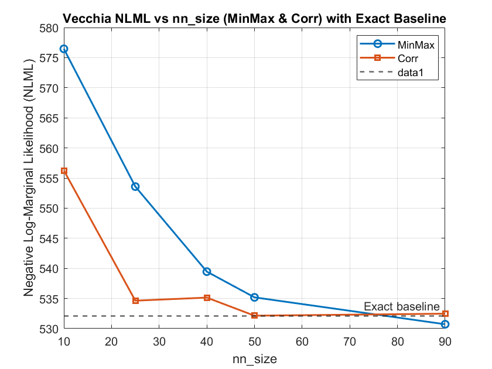
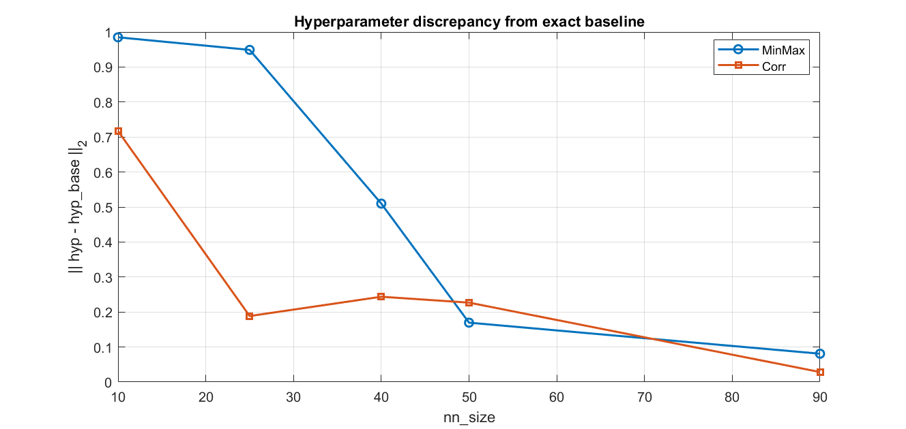
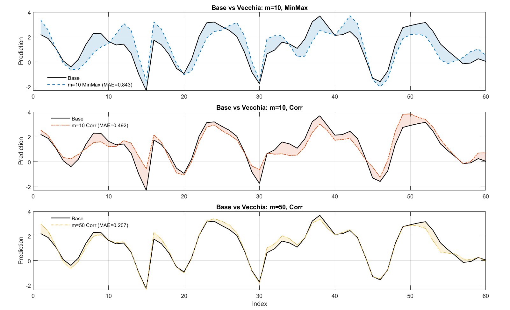

# Vecchia vs. Exact Multi-Fidelity GP — MATLAB Demo

This repository contains a MATLAB script that compares an **exact baseline** multi-fidelity GP model against **Vecchia** approximations under different neighbor sizes and conditioning strategies. It optimizes hyperparameters, evaluates on a held-out HF test set, and produces summary plots, including a **3-panel comparison** with shaded differences.

---

## What the script does

1. **Simulates data** using `simulate_data` (LF & HF; 80% stations for training).
2. **Fits an exact baseline** (RBF kernel, multiplicative combination) by maximizing NLML with `fminunc`, then predicts on the HF test set.
3. **Sweeps Vecchia settings**:
   - neighbor sizes: `[10 25 40 50 90]`
   - conditioning strategies: `MinMax` and `Corr`
   - automatic random restarts if the optimizer fails to converge
4. **Evaluates** each configuration: NLML, HF test RMSE, and L2 distance of hyperparameters from the exact baseline.
5. **Plots** three summary figures and a final **3-panel** plot comparing Base vs. selected Vecchia predictors with **shaded difference areas** and **MAE** in the legend.

---

## Requirements

- MATLAB R2020b or newer recommended
- Optimization Toolbox (`fminunc`)
- The following functions available on the MATLAB path:
  - `simulate_data.m` (produces `out.LF`, `out.HF_train`, `out.HF_test`, the function can be used to generate large dataset by setting n_time,n_space, i.e. `n_time=100` and `n_space=10`, the resulting dataset will have 10000=n_time*n_space^2  data points.)) 
  - `likelihood2Dsp.m`, `predict2Dsp.m` (exact baseline likelihood/prediction)
  - `likelihoodVecchia_nonstat_GLS.m` (Vecchia NLML with GLS intercepts)
  - `predictVecchia_CM_calibrated2.m`
  - Kernel helpers: `k1.m`, `k_matern.m`
 
The workflow uses a global struct `ModelInfo` that is populated by the script and by the likelihood functions.

---

## How to run

1. Save your script as `run_demo.m` (or another name).
2. Ensure all required helper functions above are on the MATLAB path.
3. Run in MATLAB:
   ```matlab
   clear; clc;
   run('run_demo.m');


## Results 1

Correlation conditioning (“Corr”) consistently outperforms “MinMax.” In the figure, Corr reaches the exact-likelihood line around nn_size ≈ 50, whereas MinMax needs roughly nn_size ≈ 90 to achieve a comparable value.




## Results 2

The hyperparameter distance to the baseline shows the same trend: for a given neighbor size, Corr produces smaller L2 discrepancies, particularly at smaller nn_size.




## Results 3

The prediction discrepancy (full model vs. approximation) shrinks as nn_size increases; by about nn_size ≈ 50 it becomes negligible in practice.





